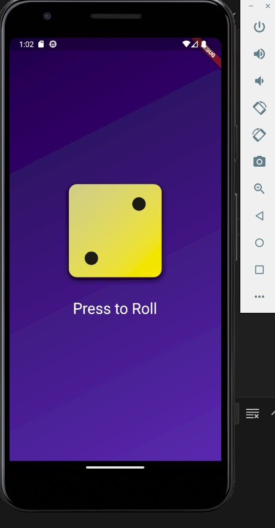
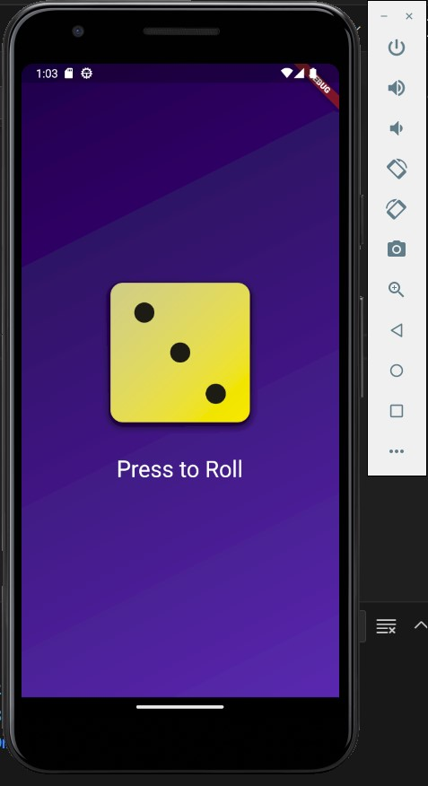

# Dice Roll App

I have created my first flutter app. This is just a basic aapp where I learned more about flutter functionalities, stateless,stateful widgets, functions, class, variables, android simulation, flutter environment

- [Lab: Write your first Flutter app](https://docs.flutter.dev/get-started/codelab)
- [Cookbook: Useful Flutter samples](https://docs.flutter.dev/cookbook)

For help getting started with Flutter development, view the
[online documentation](https://docs.flutter.dev/), which offers tutorials,
samples, guidance on mobile development, and a full API reference.
